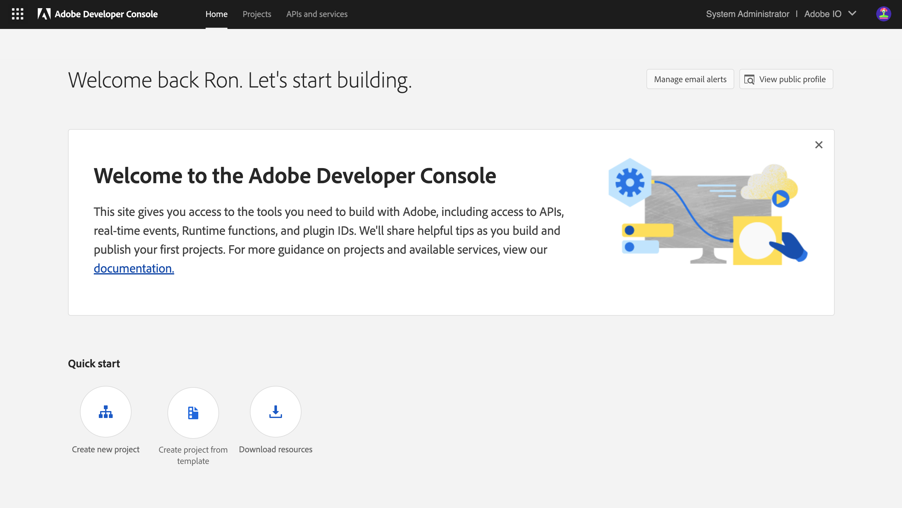
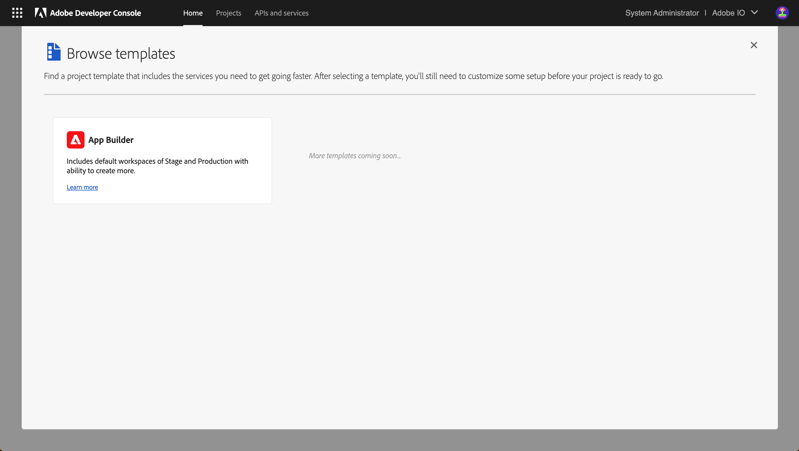
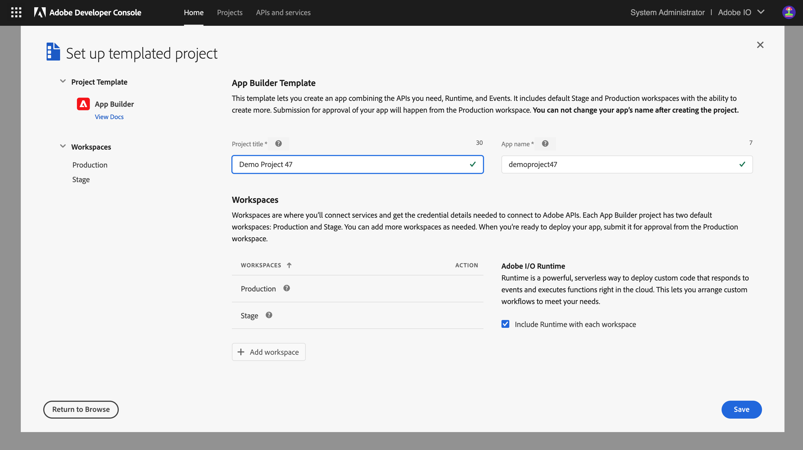
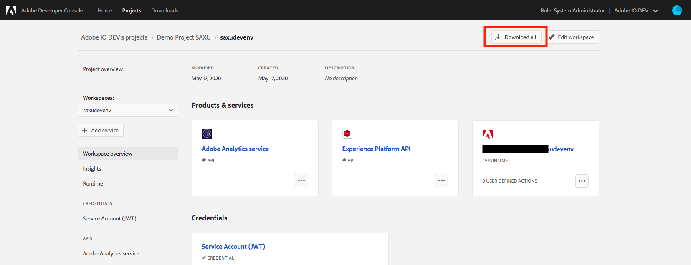
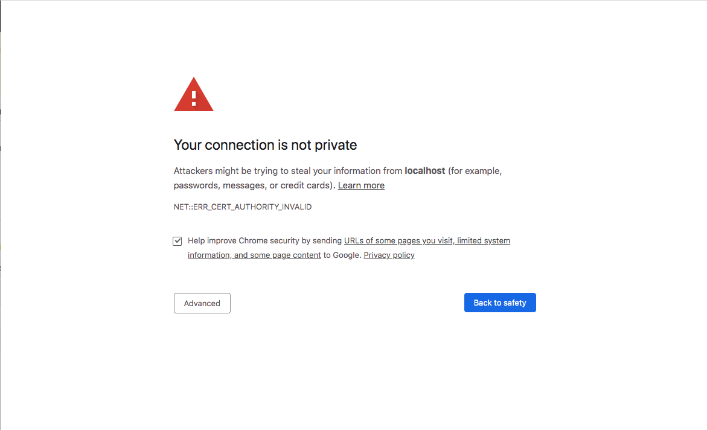
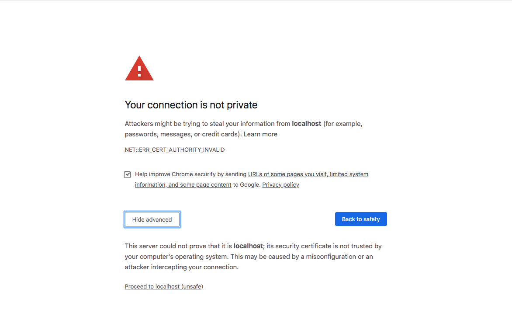
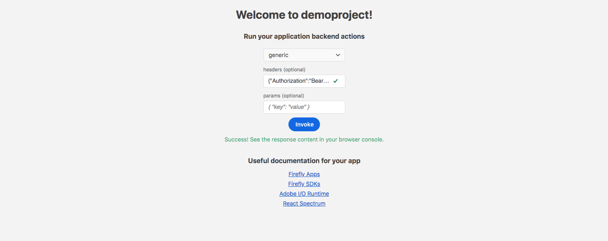

---
keywords:
  - Adobe I/O
  - Extensibility
  - API Documentation
  - Developer Tooling
---

# Creating your First App Builder Application

In this tutorial, we'll guide you through the following steps to give you an introduction on how to set up and develop an App Builder Application.

1. Setting up Local Environment
1. Creating a new Project on [Adobe Developer Console](/console)
1. Signing in from the [CLI](https://github.com/adobe/aio-cli)
1. Bootstrapping new App using [CLI](https://github.com/adobe/aio-cli)
1. Anatomy of an App Builder Application
1. Developing the Application
1. Deploying the Application

If you run into any issues during development, please first refer to the [Common Issues section](first_app.md#common-issues) on this page. If that does not resolve your issue, please refer to our [Support Channels](https://experienceleaguecommunities.adobe.com/t5/project-firefly/ct-p/project-firefly).

## 1. Setting up Local Environment

Ensure your local environment and tooling is up to date. Instructions are here: [Setting up Your Environment](./index.md). Make sure you have access to App Builder as described here [How to Get Access to App Builder](../overview/getting_access.md). If are have not yet been granted access, you may want to wait before proceeding.

## 2. Creating a new Project on Developer Console

[Adobe Developer Console](/console) gives you access to [APIs](/apis), [SDKs](https://github.com/adobe/aio-sdk) and developer tools to integrate, and extend Adobe products. In App Builder, you need access to [Adobe I/O Runtime](/apis/experienceplatform/runtime) credentials used for deploying your application, and access to API credentials if you want to access Adobe [APIs](/apis) in your application.

Follow the instructions to set up your project:

1. Navigate to [Adobe Developer Console](/console).
    

1. Use the Org Switcher on the upper right corner to ensure or to select the Org you want to use.
    

1. Once you are in the correct organization, Under `Quick Start`, click on the option to `Create project from template`.
   **Note that if you don't have the `Create project from template` option, it might be because your request to access App Builder has not yet been approved.**
   If you already submitted a request, you may want to wait for it to be approved. If you have not yet submitted a request, you might want to do that,
   as described at [How to Get Access to App Builder](../overview/getting_access.md).

1. Select `App Builder` from the list of templates.
    

1. Enter `Project Title` and `App Name` for your templated project.
    - `Project Title` is used to identify this project within [Adobe Developer Console](/console) and in [CLI](https://github.com/adobe/aio-cli). We recommend changing the default title to a meaningful project title.
    - `App Name` is a unique identifier for your application. **Note:** once project set up is complete this value cannot be changed.
    - By default, the "Include Runtime with each workspace" checkbox is checked. Each workspace is automatically provisioned with a unique [Adobe I/O Runtime](/apis/experienceplatform/runtime) namespace allowing each developer to work within their own [Adobe I/O Runtime](/apis/experienceplatform/runtime) environment.
    - If you deselect the checkbox and do not opt for automatic inclusion of [Adobe I/O Runtime](/apis/experienceplatform/runtime), you will need to enable it manually for each individual workspace. You cannot auto-add [Adobe I/O Runtime](/apis/experienceplatform/runtime) to all workspaces after the initial set up is complete.
You can manually remove [Adobe I/O Runtime](/apis/experienceplatform/runtime) from individual workspaces later if you determine that it is not needed.
    - Click `Save` when ready.
    

1. You should see a new project generated with 2 default `Workspaces`.
    - Workspaces can be used to manage different deployment environments (dev, qa, stage, prod) for your application and to provide individual working environment for each developer on the project. Workspace is where you will connect services and get the credential details needed to connect to [Adobe APIs](/apis). Connected services can differe from workspace to workspace, and the credentials used within each workspace is not shared across workspaces.
    - Each App Builder project has two default workspaces: `Production` and `Stage`. You can add more workspaces as needed. The `Production` workspace is special, as it is used for the submission and distribution flow. When you’re ready to deploy your app, you will submit it for approval from the Production workspace.
    

1. Create a new workspace or select a workspace to add [APIs](https://developer.adobe.com/developer-console/docs/guides/services/#add-a-service) and [Events](https://developer.adobe.com/developer-console/docs/guides/services/services-add-event/) that you will need for your application.
    

To learn more about Adobe Developer Console, please refer to [Console Documentation](https://developer.adobe.com/developer-console/docs).

## 3. Signing in from CLI

Once your project is set up in [Adobe Developer Console](/console), let's move onto your local environment. You can always go back to [Adobe Developer Console](/console) to modify your project later.

1. On your machine, navigate to the Terminal and enter

    ```bash
    aio login
    ```

1. A browser window should open, asking you to sign in with your Adobe ID. If the window did not automatically open, you can also copy paste the URL printed in your browser to log in.

    ```bash
    $ aio login
    Visit this url to log in: 
    https://aio-login.adobeioruntime.net/api/v1/web/default/applogin?xxxxxxxx
    ```

1. Once you've logged in, you can close the browser window and go back to Terminal. You will see a string printed in the terminal. This is your user token. It is automatically stored in [CLI](https://github.com/adobe/aio-cli) config, allowing the [CLI](https://github.com/adobe/aio-cli) to use the token to talk to [Adobe Developer Console](/console).

    ```bash
    eyJ4NXUiOixxxxxxxxxxxxxxxxxxx
    ```

1. Now you can start building App Builder Applications with the [CLI](https://github.com/adobe/aio-cli)!  

## 4. Bootstrapping new App using the CLI

There are a few sample flows listed below. Some developers may not have access to [Adobe Developer Console](/console) as entitled Enterprise Organization users but may still want to look at the project or to import credentials later.

### 4.1 Developer is Logged in as Enterprise Organization user

#### 4.1.1 Initializing your project with Extension Points

1. In your Terminal, navigate to where you want to initialize your project and type in the following command in your Terminal:

    ```bash
    aio app init <app_name>
    ```

    You will be prompted with a few questions about how you want your app to be boostrapped and configured:

1. Select `Organization` that you'd like to use for this new App Builder Application. Navigate through the list to find the project and workspace you just created. If you have a lot of organizations, you can also start typing to shorten the list.

    ```bash
    $ aio app init helloworld
    Retrieving information from Adobe Developer Console..
    ? Select Org Adobe IO DEV
    ```

1. Once you have selected org, project and workspace, next, select the product you would like to extend:

    ```bash
    ? Which extension point(s) do you with to implement?
    select components to include (Press <space> to select, <a> to toggle all, <i> to invert selection)
    ❯◉ DX Experience Cloud SPA v1
     ◉ DX Asset Compute Worker v1
    ```

1. Select the `Project` you'd like to use for this new App Builder application. Navigate through the list to find the project you just created. If you have a lot of projects, you can also start typing to shorten the list.

    ```bash
    ? Select Project Demo Project SAXU
    ```

1. Once you complete this selection, you should see the build process kicking off with necessary npm dependencies are getting installed.

    ```bash
    create package.json
    create app.config.yaml
    create .aio
    create README.md
    
    .......
    
    found 0 vulnerabilities
    
    ✔ App initialization finished!
    ```

1. Now your project is initialized! Go into the folder you just created, and you can see a number of files generated.

    ```bash
    $ cd helloworld
    $ ls
    README.md  src  app.config.yaml  package-lock.json test
    e2e   node_modules  package.json  web-src
    ```

1. Note that you still can add/remove the extension points, back-end actions, SPA front-end or Github workflows from your application later by respectively using the `aio app <add|delete> ext`, `aio app <add|delete> action`, `aio app <add|delete> web-assets` and `aio app <add|delete> ci` commands within your application folder.

1. Optionally, you can install an App Builder template using Template Registry. Discover available templates in the App Builder template registry with the following command:

    ```bash
    aio templates discover
    ```

1. Install the desired template with either of these commands:

    ```bash
    aio templates install <npm package name>
    ```

    or

    ```bash
    aio templates discover --interactive
    ```

    The template's npm package will be downloaded and extracted, and Developer Console resources such as services and workspaces will be created and configured based on the template's **install.yaml** configuration file. `npm install` will run in the background to install the npm package.

#### 4.1.2 Initializing an empty project

1. In your Terminal, navigate to where you want to initialize your project and type in the following command in your Terminal:

    ```bash
    aio app init <app_name> --standalone-app
    ```

    You will be prompted with a few questions about how you want your app to be boostrapped and configured:

1. Select `Organization`, `Project` and `Workspace` that you'd like to use for this new App Builder Application. Navigate through the list to find the project and workspace you just created. *If you have a lot of organizations / projects / workspaces, you can also start typing to shorten the list.* Upon completing the selection, the [CLI](https://github.com/adobe/aio-cli) automatically downloads a `console.json` file that contains all the credentials from your workspace to be used in your App Builder project.

    ```bash
    $ aio app init helloworld
    Retrieving information from Adobe Developer Console..
    ? Select Org Adobe IO DEV
    ? Select Project Demo Project SAXU
    ? Select Workspace saxudevenv
       create console.json
    ```

1. Next, you will be asked to select app features to enable:

    ```bash
    You are about to initialize the project 'demoproject'
    Generating code in: /Users/sarahxxu/Dropbox/Development/helloworld
    ? Which Adobe I/O App features do you want to enable for this project?
    select components to include (Press <space> to select, <a> to toggle all, <i> to invert selection)
    ❯◉ Actions: Deploy Runtime actions
     ◉ Events: Publish to Adobe I/O Events
     ◉ Web Assets: Deploy hosted static assets
     ◉ CI/CD: Include GitHub Actions based workflows for Build, Test and Deploy
    ```

    Each option indicates a feature you can enable for your App Builder application. Select one or all the options depending on the application you intend to build. We recommend you select all for now to fully explore all the options.

    - **Actions: Deploy Runtime actions:** adding the boilerplate for backend serverless actions on [Adobe I/O Runtime](/apis/experienceplatform/runtime)
    - **Events: Publish to Adobe I/O Events:** adding the boilerplate for a serverless action that publishes [Custom I/O Events](/apis/experienceplatform/events/docs.html#!adobedocs/adobeio-events/master/using/custom_events.md)
    - **Web Assets: Deploy hosted static assets:** adding the boilerplate for frontend [React-Spectrum](https://react-spectrum.adobe.com/) SPA and static assets
    - **CI/CD: Include GitHub Actions based workflows for Build, Test and Deploy:** adding the boilerplate for Github Actions supporting CI/CD process of the application

1. If you included `Actions` in your last selection, you will be asked to select one or more sample actions to be generated along with the new app.

    ```bash
    ? Which type of sample actions do you want to create?
    select type of actions to generate (Press <space> to select, <a> to toggle all, <i> to invert selection)
    ❯◯ Adobe Analytics
     ◯ Adobe Experience Platform: Realtime Customer Profile
     ◉ Generic
    ```

    These sample actions help you quickly get started and show best practices for integrating with [Adobe APIs](/apis) using [SDK](https://github.com/adobe/aio-sdk) in your applications.
Note that you may not see all the options listed below on your command line, because we make recommendations based on what credentials you have added in the selected workspace. Similar to the last step, you can select one or all of the options listed:

    - **Adobe Target**: including dependencies and examples of accessing the [Adobe Target API](https://developers.adobetarget.com/api/#admin-apis)
    - **Adobe Analytics**: including dependencies and examples of accessing the [Adobe Analytics 2.0 API](https://adobedocs.github.io/analytics-2.0-apis/)
    - **Adobe Audience Manager: Customer Data**: including dependencies and examples of accessing the [Adobe Audience Manager Customer Data API](https://docs.adobe.com/content/help/en/audience-manager/user-guide/api-and-sdk-code/api.html)
    - **Adobe Campaign Standard**: including dependencies and examples of accessing the [Adobe Campaign Standard (ACS) API](https://docs.adobe.com/content/help/en/campaign-standard/using/working-with-apis/get-started-apis.html)
    - **Adobe Experience Platform: Realtime Customer Profile**: including dependencies and examples of accessing the [Realtime Customer Profile API of Adobe Experience Platform](/apis/experienceplatform/home/api-reference#!acpdr/swagger-specs/real-time-customer-profile.yaml)
    - **Generic**: a generic back-end action with hello world flow that can be reused and modified e.g. for simple serverless computing or 3rd party API integration

1. If you included `Web Assets` under Adobe I/O App features you will be given two choices. One to include React Spectrum based UI template or a Vanilla HTML/JS one

    ```bash
    ? Which type of UI do you want to add to your project? select template to generate (Use arrow keys)
    ❯ React Spectrum 3 UI
      Raw HTML/JS UI
    ```

    - The `React Spectrum 3 UI` template will add a React based UI with [React Spectrum](https://react-spectrum.adobe.com/) components included.
    - The `Raw HTML/JS UI` will add a Valinna HTML/JS/CSS UI with [Spectrum CSS](https://opensource.adobe.com/spectrum-css) styles included.

    Both the templates comes with boilerplate code needed to integrate your App Builder application with [Adobe Experience Cloud](../guides/exc_app/index.md)

1. We'll ask you to define the name for the instance of each selected sample actions. You can keep the default name or specify your own.

    ```bash
    ? We are about to create a new sample action that interacts with the Adobe Analytics API
    how would you like to name this action? analytics
    ? We are about to create a new sample action that interacts with the Adobe Experience Platform: Realtime Customer Profile
    how would you like to name this action? customer-profile
    ? We are about to create a new sample action that showcases how to access an external API
    how would you like to name this action? (generic) 
    ```

1. Once you complete this select, you should see the build process kicking off with necessary npm dependencies are getting installed.

    ```bash
    create package.json
    create app.config.yaml
    create .aio
    create README.md
    
    .......
    
    found 0 vulnerabilities
    
    ✔ App initialization finished!
    ```

1. Now your project is initialized! Go into the folder you just created, and you can see a number of files generated.

    ```bash
    $ cd helloworld
    $ ls
    README.md  console.json  app.config.yaml  package-lock.json test
    actions   e2e   node_modules  package.json  web-src
    ```

1. Note that you still can add/remove the back-end actions, SPA front-end or Github workflows from your application later by respectively using the `aio app <add|delete> action`, `aio app <add|delete> web-assets` and `aio app <add|delete> ci` commands within your application folder.

### 4.2 Developer is not Logged in as Enterprise Organization user

#### Developer with a Console config file

This flow is intended for developers who do not have access to [Adobe Developer Console](/console) as entitled Enterprise Organization users, likely due to permission issues, but can get credentials that are tied to an App Builder workspace from an entitled Enterprise Organization administrator or developer.

For this flow to work, the developer should ask someone with access to set up a project and a workspace following the last few sections. With the workspace correctly set up, the credentials can downloaded by authorized [Adobe Developer Console](/console) users through the `Download all` button in Workspace overview.



1. In Terminal, navigate to where you want to initialize your project and type in the following command:

    ```bash
    aio app init <app_name> --import <path_to_config_file>
    ```

1. Select project configuration options (see section above)
1. When your project is initialized, go into the folder you just created, and you can see a number of files generated.

    ```bash
    $ cd helloworld
    $ ls
    README.md  e2e   node_modules  package.json  web-src
    actions   app.config.yaml  package-lock.json test
    ```

1. When you generate a project with a downloaded configuration file without logging into [Adobe Developer Console](/console) on your [CLI](https://github.com/adobe/aio-cli), everything should be the same.
We use the values from the downloaded file to pre-populated values in your `.env` and `.aio`. The only difference you will notice is the missing `config.json` file because that's the file you used to generate this project.

#### Developer without any credentials

This flow is intended for developers who have no access or credentials whatsoever but still want to look at the code.

1. In your Terminal, navigate to where you want to initialize your project and type in the following command in your Terminal:

    ```bash
    aio app init <app_name> -y
    ```

    The `-y` flag allows user to skip all questions and generates a sample project with only the `generic` sample action.

1. You should still be able to see similar files generated, but none of the config files will be pre-polulated.

    ```bash
    $ cd helloworld
    $ ls
    README.md  e2e   node_modules  package.json  web-src
    actions   app.config.yaml  package-lock.json test
    ```

1. You will not be able to run or to deploy your application by default because there is no credential provided.

## 5. Anatomy of an App Builder Application

Now that your project is initialized, let's open the project in your favorite IDE. We recommend using [VSCode](https://code.visualstudio.com/). You can easily open the project by entering `code <app-name>`, or opening VSCode -> Open... -> select app folder.

You should be able to see these folders and files in your project:

1. `src`: Instead of one folder for all `actions` and all `web-src`, you will see individual folders under `src` for each Extension point you have selected. For instance, a `dx-excshell-1` folder for your Experience Cloud SPA actions and frontend resources.
    - Under each folder, you should be able to see both the actions and the frontend code when application. In addition, you should be able to see `ext.config.yaml`. This file contains all the action and extension configuration for the extension point where it's located. This individual configuration allows for more flexibility in defining and managing individual extension points. You can see that this file is also imported to `app.config.yaml` as that's the master config file.
    - The action definition in this file shoud adhere to the [OpenWhisk deployment YAML specification](https://github.com/apache/openwhisk-wskdeploy/tree/master/specification#package-specification).
    - Once defined, the [CLI](https://github.com/adobe/aio-cli) use this file to deploy or redeploy actions. You might see values like `$CUSTOMER_PROFILE_TENANT` listed under environments in this file. These are environment variables that you can define in your `.env` file.
1. `test`: this folder is intended for back-end action unit tests and integration tests
1. `e2e`: this folder is intended for  end-to-end tests
1. `app.config.yaml`: this is the master configuration file. It follows the same principle as the individual `ext.config.yaml`, and compiles these individual file into one comprehensive config upon application build.
1. `lib`: this folder will contain all the shared utility actions across different extension points.
1. `package.json`: this file describes project definition and various metadata relevant to the project.
    - It is used to give information to npm that allows it to identify the project as well as handle the project's dependencies. Learn more [here](https://nodejs.org/en/knowledge/getting-started/npm/what-is-the-file-package-json/).
1. `.aio`: this file contains config variables that are useful for the [CLI](https://github.com/adobe/aio-cli) to facilitate the app, e.g. supported API services. **This file can be committed to a source code versioning system.**
    - You can manually update the file or use the `aio config` commands to add or to remove configurations. Learn more about the [Config Plugin](https://github.com/adobe/aio-cli-plugin-config).
1. `.env`: this file contains environment variables that are useful for the app during development, e.g. Adobe I/O Runtime credentials and Adobe Product API tenant specifics (API key, secrets, etc.)
    - The environment variables defined here can be used in the application (e.g. in `ext.config.yaml` or `app.config.yaml`). If you've set up credentials for the selected workspaces, you should be able to see some of those values prepopulated upon initialization, like `AIO_runtime_auth` and `AIO_runtime_namespace`.
    - This file is automatically included in `.gitignore`. **It is not intented be shared given the credentials and secrets listed.**

## 6.Developing the Application

### 6.1 Running the Application

To run the application locally, use one of the following commands:

```bash
aio app run --local
```

This will deploy the actions to a local [OpenWhisk](https://openwhisk.apache.org/) instance, which the [CLI](https://github.com/adobe/aio-cli) will autmomatically download and install. The SPA will be run on the local machine.

```bash
aio app run
```

This will deploy the actions to [Adobe I/O Runtime](/apis/experienceplatform/runtime), while running the UI part on the local machine.

#### (First time users) Accepting the Certificate

If you are using this application for the first time, you will see a message similar to

```bash
success: generated certificate
A self signed development certificate has been generated, you will need to accept it in your browser in order to use it.
Waiting for the certificate to be accepted.... timed out
```

This message pops up because we use a development SSL certificate for secure communication. Understand more about the purpose of this certificate [here](https://letsencrypt.org/docs/certificates-for-localhost/).

If you see this message, please navigate to `https://localhost:9080`, you should see a screen similar to this.


Click on `Advanced`, the nex screen may vary from browser to browser, but you should see a screen like this, where you can click on `Proceed to localhost (unsafe)` to accept the certificate.


You may need to exit the current process and run `aio app run` again.

#### Proceeding to the Application on localhost

For users who have accepted the certificate in the past, you should see the following process running in Teminal instead. You can see your backend actions are being deployed to [Adobe I/O Runtime](/apis/experienceplatform/runtime) (or to the local OpenWhisk instance if the `--local` option has been used.

```bash
$ aio app run
> Local Dev Server
ℹ using remote actions
ℹ redeploying actions..
......
ℹ writing credentials to tmp wskdebug config '.wskdebug.props.tmp'..
ℹ injecting backend urls into frontend config
ℹ starting local frontend server ..
ℹ local frontend server running at https://localhost:9080
ℹ setting up vscode debug configuration files..
ℹ press CTRL+C to terminate dev environment
```

There are two URLs printed:

```bash
To view your local application:
  -> https://localhost:9080
To view your deployed application in the Experience Cloud shell:
  -> https://experience.adobe.com/?devMode=true#/custom-apps/?localDevUrl=https://localhost:9080
```

The first URL allows you to see your standalone application on localhost (by default, but the port is configurable). The second URL places your local application in the context of the [Experience Cloud UI](../guides/exc_app/index.md) for preview.

While most changes in your code get updated in real-time when your application is running, the `.env` file is not among them. Running the application depends on `.env` file to provide necessary credentials, so the file is unmodifiable while the app is running. When your app is running, the `.env` file is backed up, and a new one is written with specific values. When you exit the process, the original `.env` is restored.

As indicated in the message, when you are done, you can press `CTRL+C` to terminate the local development environment.

To have the application run completely locally, which means the actions will run on a local deployed (standalone) version of OpenWhisk instead of on [Adobe I/O Runtime](/apis/experienceplatform/runtime), use `aio app run --local`. Some additional dependencies are required if you have not installed them yet, see  `Optional tools` section in  [Setting up Your Environment](./index.md) if you want to set them up manually.

Usually, we recommend running your applications with deployed [Adobe I/O Runtime](/apis/experienceplatform/runtime) actions, as your application should run on [Adobe I/O Runtime](/apis/experienceplatform/runtime) in production. However, if you need to build complex actions or sequencing, the `--local` flag is handy to locally debug the application. Please see the Debugging the Application section below for more info.

### 6.2 Trying the Sample Application

When you access `https://localhost:9080`, you should see the sample application deployed.


This simple SPA contains links to documentation and allows you to run your backend actions for tests. To try it, use the selection box to pick the action you'd like to invoke. You can also pass request headers and parameters from the corresponding input fields in the SPA UI.

All actions require `Authorization` and `x-gw-ims-org-id` in the headers by default. In your project code, if you navigate to `app.config.yaml`, you can see that a `require-adobe-auth` annotation is set to `true` for all the sample actions. Having this flag enabled enforces a valid user token be used to invoke this action. We recommend always having this enabled for security reasons. You can learn more about this in our [Security Overview](../guides/security/index.md).

1. With the `require-adobe-auth` annotation set to `true`, you need to pass in a valid user token and corresponding organization ID to invoke your action. You can easily retrieve the token from your [CLI](https://github.com/adobe/aio-cli) by typing in `aio login`, and the org ID (look for `some_hash@AdobeOrg`) from the workspace details on [Adobe Developer Console](/console) or from the URL of [Adobe Admin Console](https://adminconsole.adobe.com) (make sure that you have the correct organization selected in the top right corner).
You can also list all the organizations you belong to and their org ID from your [CLI](https://github.com/adobe/aio-cli) by typing in `aio console org list`.

1. Put the token and org ID into this following format.
    `{"Authorization":"Bearer <token_from_cli>","x-gw-ims-org-id":"<org-id-from-console>"}`
1. Go back to your browser, and put the joined value in the `headers` input field. You should now be able to invoke actions that does not require additional params (like `generic`).


**Note:** If you open your application in the [Experience Cloud Shell](http://experience.adobe.com/) using the second link provided by the CLI, your Experience Cloud Shell user token will automatically be available to the SPA UI and passed by this one to the underlying [Adobe I/O Runtime](/apis/experienceplatform/runtime) actions of your application.
This is a very useful feature of our SPA UI template, which integrates for you with the [client-side API](../guides/exc_app/index.md) of the [Experience Cloud Shell](http://experience.adobe.com/).

The other sample actions require futher paramaters to be invoked. For instance, if you try to invoke `analytics` with only the authorization header, you would see an error similar to `"error": "missing parameter(s) 'apiKey,companyId'"`. This is because these sample actions use Adobe API that requires those params before it can be invoked.

1. Each sample action requires different params. Some only needs an API key, some also requires the tenant ID or more information. Go into the action code in `actions` folder to learn more.
1. The API key is a common required field. If you have the service added in the current workspace, it is easily retrievable in `.env` or `console.json` file.
1. Other fields are not accessible directly through the [CLI](https://github.com/adobe/aio-cli), like tenant ID for Target and for Campaign Standard or company ID for Adobe Analytics. Please refer to product documentation to locate these value for your Org.
1. Once you have these parameters handy, construct them in the expected format `{"key": "value"}` and paste into the params. You should now be able to invoke these actions.

### 6.3 Debugging the Application

Our [CLI](https://github.com/adobe/aio-cli) is integrated with an open source project [wskdebug](https://github.com/apache/openwhisk-wskdebug) to support debug functionalities. You can develop and debug OpenWhisk actions in your favorite IDE or debugger with a fast feedback loop. It features:

- Full debugging of actions of the respective language runtime
- Automatic code reloading
- LiveReload for web actions
- Auto-invoking of actions on code changes
- Or running any shell command such as a curl request on code changes

Please visit [Debugging App Builder Apps Codelab](../resources/debugging/index.md) to set up your local environment and go through step-by-step instructions.

If the local development is run without the `--local` option, the action you are debugging is running directly on [Adobe I/O Runtime](/apis/experienceplatform/runtime). When the `--local` option is used, the actions are debugged in the standalone OpenWhisk instance running locally. In both cases, Docker is required on your local machine so that the remote or locally mounted actions get proxied in the local Docker container. Learn more about what you can do in [debug mode](https://www.npmjs.com/package/@openwhisk/wskdebug).

#### Targeting local actions with `aio runtime` 
To target local actions with `aio runtime`, you will have to populate the project's `.env` with the local Runtime credentials. 

These credentials can be found in `dist/<extension|application>/.env.local`. 

```
AIO_runtime_auth=
AIO_runtime_namespace=
AIO_runtime_apihost=
```

Once the project's `.env` has been populated with the local Runtime credentials, commands executed with `aio runtime` in the root project directory will target the locally deployed instance of Runtime. 

### 6.4 Retrieving Logs for the Application

To see your application logs, use the command `aio app logs`. By default, only the logs of the latest activation is fetched. If you want to see a more extensive list of logs, use the `--limit` flag to define the number of recent activations to be fetched.

Read more at [Managing Application Logs](../guides/application_logging.md)

### 6.5 Testing the Application

The bootstrapped application comes with sample implementations for both unit and end-to-end tests.
You can execute these tests locally by using `aio app test` and `aio app test -e`, which will respectively run the unit and end-to-end tests against the bootstrapped codebase.

As you modify and extend the code of your application, you will need to update the tests accordingly.

We are using [jestJS](https://jestjs.io/) for the unit tests of the [CLI](https://github.com/adobe/aio-cli), [SDK](https://github.com/adobe/aio-sdk) and bootstrapped application. It is possible to change the implementation to your preferred framework.

[CI/CD for App Builder Applications](../guides/deployment/ci_cd_for_firefly_apps.md) also explains how to execute these tests in the context of a CI/CD pipeline.

## 7 Deploying the Application

Once the application is in a good shape, it can be fully deployed to your development workspace. This is achievable with a single command.

```bash
aio app deploy
```

This command may take a minute or two as behind the scenes the [CLI](https://github.com/adobe/aio-cli) is building and deploying:

- The actions defined in `app.config.yaml` into [Adobe I/O Runtime](/apis/experienceplatform/runtime)
- The frontend built files and assets into our out-of-the-box CDN

The [CLI](https://github.com/adobe/aio-cli) output details this process:

```bash
> Build actions
ℹ dist/actions/analytics.zip
...

> Build static files
ℹ dist/web-src-prod/index.html
...

> Deploy actions
ℹ Info: Deploying package [demoproject-0.0.1]...
...

> Deploy static files
ℹ index.html

...

Your deployed actions:
  -> demoproject-0.0.1/__secured_analytics 
...

To view your deployed application:
  -> https://<namespace>.adobeio-static.net/<packagename>/index.html
To view your deployed application in the Experience Cloud shell:
  -> https://experience.adobe.com/?devMode=true#/custom-apps/?localDevUrl=https://<namespace>.adobeio-static.net/<packagename>/index.html
Well done, your app is now online 🏄
```

Note the last section of the output `To view your deployed application`. There are 2 urls of the app shown by default, which allow access either to the CDN host or [Experience Cloud Shell](http://experience.adobe.com/). In the latter case, The URL format of the app should follow `https://experience.adobe.com/?devMode=true#/custom-apps/?localDevUrl=<your-app-url>`.

You can also undeploy your app with `aio app undeploy`. To learn more about deployment, please refer to [Deployment Overview](../guides/deployment/index.md). To automate your build, deploy and build process with our out-of-the-box CI/CD GitHub actions, please refer to [CI/CD for App Builder Applications](../guides/deployment/ci_cd_for_firefly_apps.md).

## Common Issues

1. When in doubt, please first ensure your [CLI](https://github.com/adobe/aio-cli) and all plugins are up to date. For the [CLI](https://github.com/adobe/aio-cli), you can check the version through `aio -v` and compare it with `npm show @adobe/aio-cli version`. If your [CLI](https://github.com/adobe/aio-cli) is outdated, update it by running `npm install -g @adobe/aio-cli`. After that, you can simply run `aio update` to ensure all core plugins are updated.

1. Validation error. If you see the following error, it is because you did not pass in an authorization header to an action expecting one. See `Trying the Sample App` section above or learn more about this in our [Security Overview](../guides/security/index.md).

    ```bash
    {"error": "cannot validate token, reason: missing authorization header"}
    ```

1. Missing param error. If you see the following error, it is because you did not pass in required params to an action expecting one. See `Trying the Sample App` section above.

    ```bash
    {"error": "missing parameter(s) 'apiKey,companyId'"}`
    ```

## Next steps

For more code examples and use cases, please refer to the [Resources page](../resources/index.md).
