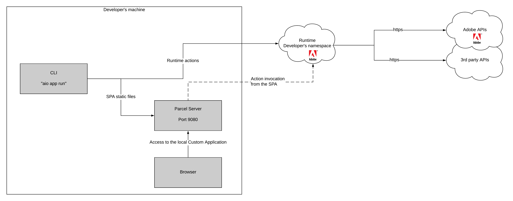

---
keywords:
  - Deployment
  - Local Deployment
  - Architecture
title: Deployment
description: The CLI provides out-of-the-box features for developers to manage the lifecycle of their  App Builder Applications. This documentation focuses on the application deployment step of this lifecycle.
---

# Deployment Overview

The [CLI](https://github.com/adobe/aio-cli) provides out-of-the-box features for developers to manage the lifecycle of their  App Builder Applications. This documentation focuses on the application deployment step of this lifecycle.

## Setup Assumptions

In the following chapters of this documentation, it will be assumed that:

- The Custom Adobe Application has been bootstrapped from a [generator](https://github.com/adobe/generator-aio-app/) using the [CLI](https://github.com/adobe/aio-cli)
- There is a **.env** file at the root of the application folder, which contains the following keys and their values:

  - **AIO_RUNTIME_AUTH**, which holds the credentials for the Runtime namespace to use
  - **AIO_RUNTIME_NAMESPACE**, which holds the name of the Runtime namespace to use

If you do not own a [Runtime](https://developer.adobe.com/runtime) namespace, please [request trial access](https://developer.adobe.com/app-builder/trial/).

The [Setup Requirements](../../getting-started/index.md) documentation should also be checked before trying out the deployment scenarios described below.

The [CLI](https://github.com/adobe/aio-cli) offers three types of deployment to the developers.

## Local Deployment

Local deployment capabilities are offered to developers who want to test and debug their application before it is deployed to the out-of-the-box Content Delivery Network.

### Local Runtime actions and UI

#### Use-Case

This local deployment feature is useful for developers who want to easily get an initial preview of their Custom Application before deploying it to [Runtime](https://developer.adobe.com/runtime) and to the out-of-the-box Content Delivery Network. They will also benefit from local [Runtime](https://developer.adobe.com/runtime) actions and UI debugging capabilities.

It also helps developers who want to work on their Custom Application implementation without an appropriate Internet connection. Of course, in that case you are not able to interact with [Adobe APIs](https://developer.adobe.com/apis) or with remote 3rd party systems.

The tradeoff is that developers will not be able to run code that uses [Files](https://github.com/adobe/aio-lib-files) or [State](https://github.com/adobe/aio-lib-state) SDKs, [cron jobs scheduler with Alarms package](https://developer.adobe.com/app-builder/docs/resources/cron-jobs/), as well as expose web actions as webhooks for [I/O Events](https://developer.adobe.com/events) or external events providers. These are only available if the actions are deployed to [Runtime](https://developer.adobe.com/runtime).

This deployment scenario doesn't require any specific credentials, as both [Runtime](https://developer.adobe.com/runtime) actions and application UI are hosted on the developer's machine.

#### CLI Command

This deployment is triggered when running `aio app dev` at the root of the Custom Application source code directory.

#### Architecture


The [Runtime](https://developer.adobe.com/runtime) actions of the application will be run in NodeJS.

```
http://localhost:9080/api/v1/web/<namespace>/<pkg-name>/<action-name>
```

**pkg-name** and **action-name** is the name of the package and action, which has been chosen by the developer when bootstrapping the application from the generator that was executed with `aio app init <appname>`.

In case of a headful Custom Application, the UI will be served locally from [ParcelJS](https://parceljs.org/features/cli), which is the underlying framework used by the [CLI](https://github.com/adobe/aio-cli) to build the front-end source code.

### Remote Runtime actions and local UI

#### Technical Prerequisites

This deployment scenario requires [Runtime](https://developer.adobe.com/runtime) credentials in a .env file at the root of the Custom Application source code folder, as documented in the **Setup Assumptions** above.

#### Use-Case

This feature is useful for developers who want to test and debug locally their Custom Application in a live environment fully integrated to Adobe's ecosystem, with minimal deployment time and efforts.

#### CLI Command

This deployment is triggered when running `aio app run` at the root of the Custom Application source code directory.

#### Architecture



The UI is still served locally from [ParcelJS](https://parceljs.org/features/cli/), which allows hot updates of the front-end code. It communicates with [Runtime](https://developer.adobe.com/runtime) actions deployed to the developer's Runtime namespace.

## Full Deployment

#### Technical Prerequisites

This deployment scenario requires [Runtime](https://developer.adobe.com/runtime) credentials in a .env file at the root of the Custom Application source code folder, as documented in the **Setup Assumptions** above.

#### Use-Case

This feature is useful for developers who want to test and preview their Custom Application fully integrated to Adobe's ecosystem, in conditions that are similar to a production deployment.

#### CLI Command

This deployment is triggered when running `aio app deploy` at the root of the Custom Application source code directory.

#### Architecture


The UI is deployed to the out-of-the-box content Content Delivery Network on behalf of the developer's Runtime credentials. It communicates with [Runtime](https://developer.adobe.com/runtime) actions deployed to the developer's Runtime namespace.

The out-of-the-box [Token-Vending Machine](https://github.com/adobe/aio-tvm) is implicitely used by the CLI `aio app deploy` command, and validates the developer's Runtime credentials against [Runtime](https://developer.adobe.com/runtime).

If the credentials are valid, the Token-Vending Machine provides an access token to the CLI, which will authorize the CLI to deploy the static files of the Custom Application to the Content Delivery Network.

The deployed Custom Application will then be available at `https://<namespace>.adobeio-static.net/index.html`