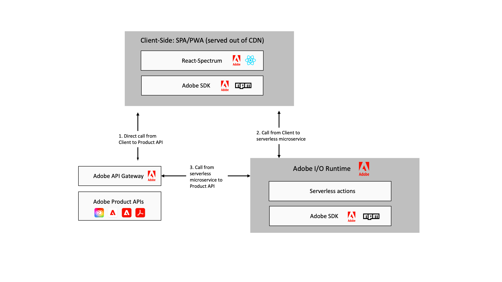

---
keywords:
  - Headless Application
  - Headful Application
  - SDK Components
  - SDK Library
  - Migration Guides
title: Guides
description: An App Builder Application is a serverless application that extends Adobe Product APIs. These applications can be headless or headful. Each of these types is described in more detail in the sections that follow.
---

# Architecture Overview

## Types of App Builder apps

An App Builder Application is a serverless application that extends [Adobe Product APIs](/apis).
These applications can be one of two kinds: headless or headful. Each of these types is described in more detail in the sections that follow.

### Headless Application

In a headless application, the application consists of a set of serverless actions and/or sequences deployed to [Runtime](/apis/experienceplatform/runtime), Adobe's serverless platform.

A typical headless application would integrate well with a remote script or process that invokes it, such as an [AEM Assets workflow](https://docs.adobe.com/content/help/en/experience-manager-65/assets/using/assets-workflow.html) or an [ACS activity](https://docs.adobe.com/content/help/en/campaign-standard/using/managing-processes-and-data/data-management-activities/external-api.html).

### Headful Application

A headful application is a Single Page Application (SPA) with a full-fledged user interface (UI) served from the out-of-the-box Content Delivery Network. This type of application calls [Adobe Product APIs](/apis) directly from the client when applicable. When there is a strong need to orchestrate [Adobe Product API](/apis) calls with 3rd party API calls, or with Adobe Identity Management System for authentication purposes, you can deploy serverless actions and/or sequences using [Runtime](/apis/experienceplatform/runtime).

## JAMStack: Anatomy of an App Builder App

App Builder apps that are Single Page Applications with a full-fledged UI should follow the [JAMStack Architecture](https://jamstack.org/).

The three main components of App Builder apps are:

- [Adobe Product APIs](/apis), exposed to external developers and consumers through Adobe I/O API Gateway.
- [Javascript-based SDK](https://github.com/adobe/aio-sdk) and serverless actions, sequences, and APIs deployed to [Runtime](/apis/experienceplatform/runtime).
- [React-Spectrum](https://react-spectrum.adobe.com/), Adobe's front-end framework which applies Adobe's Design System to React-based components.

## SDK Components

### CLI

The [CLI](https://github.com/adobe/aio-cli) is one of the main touchpoints for App Builder developers. It is based on [oclif](https://oclif.io/), which is a popular framework to build extensible command line tools.

The CLI comes out-of-the-box with the following capabilities:

- [Authentication](https://github.com/adobe/aio-cli-plugin-auth) to Adobe's Identity Management System
- [Certificate management](https://github.com/adobe/aio-cli-plugin-certificate)
- [Configuration management](https://github.com/adobe/aio-cli-plugin-certificate)
- [Interactions](https://github.com/adobe/aio-cli-plugin-console) with [Adobe Developer Console](/console)
- [Interactions](https://github.com/adobe/aio-cli-plugin-runtime) with [Runtime](/apis/experienceplatform/runtime), Adobe's serverless platform
- [Lifecycle management](https://github.com/adobe/aio-cli-plugin-app) for [App Builder](/app-builder)

### App Builder Generators

The [generators](https://github.com/adobe/generator-aio-app) help developers to bootstrap their App Builder apps when using the [CLI](https://github.com/adobe/aio-cli).

Generators can be used to create:

- A headless application
- A full-fledged UI SPA that deploys into [Experience Cloud Unified shell](http://experiencecloud.adobe.com/)
- [Runtime](/apis/experienceplatform/runtime) serverless actions extending specific [Adobe APIs](/apis)

### SDK Libraries

App Builder also provides a collection of JavaScript-based SDK libraries designed to increase the developer's velocity when implementing Custom Applications on top of Adobe APIs.

#### Main SDK library

The [main SDK library](https://github.com/adobe/aio-sdk) bundles smaller, reusable SDK libraries serving a variety of use-cases:

##### Integration with Adobe APIs

- The [Adobe Analytics](https://github.com/adobe/aio-lib-analytics) SDK library provides a client for [Adobe Analytics 2.0 API](https://adobedocs.github.io/analytics-2.0-apis/).
- The [Adobe Target](https://github.com/adobe/aio-lib-target) SDK library provides a client for [Adobe Target 1.0 API](https://developers.adobetarget.com/api/).
- The [Adobe Campaign Standard](https://github.com/adobe/aio-lib-campaign-standard) SDK library provides a client for [Adobe Campaign Standard API](https://experienceleague.adobe.com/docs/campaign-standard/using/working-with-apis/get-started-apis.html?lang=en).

##### Integration with Adobe's Identity Management System

The [Adobe IMS SDK library](https://github.com/adobe/aio-lib-core-ims) provides authentication management capabilities to Adobe's Identity Management Services, for both of the following scenarios:

- [User-based (OAuth 2.0)](https://github.com/adobe/aio-lib-core-ims-oauth)
- [Technical account-based (JWT Bearer-token)](https://github.com/adobe/aio-lib-core-ims-jwt)

##### Integration with additional out-of-the-box services 

- The [Files SDK](https://github.com/adobe/aio-lib-files) provides a file system-like abstraction on top of an out-of-the-box cloud storage to store large, temporary files.
- The [State SDK](https://github.com/adobe/aio-lib-state) provides a state-like abstraction on top of an out-of-the-box cloud-based key-value store.

##### Technical framework for developers

The [Core SDK library](https://github.com/adobe/aio-sdk-core) bundled into the [main SDK library](https://github.com/adobe/aio-sdk) provides a lower-level technical framework for developers.   

This framework must be used when contributing to the App Builder SDK. It is also recommended to use it when building an App Builder application.

#### Core SDK library

The [Core SDK library](https://github.com/adobe/aio-sdk-core) enables developers with the following technical capabilities:

##### Configuration

The [Configuration SDK library](https://github.com/adobe/aio-lib-core-config) allows management of persistent and environment variable configuration.

##### Logging

The [Logging SDK library](https://github.com/adobe/aio-lib-core-logging) provides a logger abstraction that can be used in [SDK libraries](https://github.com/adobe/aio-sdk) and serverless actions deployed to [Runtime](/apis/experienceplatform/runtime).

##### Errors

The [Errors SDK library](https://github.com/adobe/aio-lib-core-errors) is the base implementation for all errors thrown by the [SDK libraries](https://github.com/adobe/aio-sdk) and can be used by developers to manage their own errors.

##### Networking

The [Networking SDK library](https://github.com/adobe/aio-lib-core-networking) provides low-level networking tools such as exponential back-off that can be used in [SDK libraries](https://github.com/adobe/aio-sdk) and custom API clients.

### Token-Vending Machine

The [Token-Vending Machine](https://github.com/adobe/aio-tvm) is exposed as an out-of-the-box API deployed to [Runtime](/apis/experienceplatform/runtime).

It enables developers to perform the following actions on behalf of their App Builder application credentials:

- Deploy the web assets of their App Builder application to the out-of-the-box CDN.
- Use the out-of-the-box cloud storage through the [Files SDK](https://github.com/adobe/aio-lib-files).
- Use the out-of-the-box key-value store through the [State SDK](https://github.com/adobe/aio-lib-state).

### CI/CD Support

The [out-of-the-box CI/CD support](./deployment/ci_cd_for_firefly_apps.md) for App Builder Applications consists in:

- [Github Actions](https://github.com/features/actions) to [setup the CLI](https://github.com/adobe/aio-cli-setup-action) and use it to [perform actions](https://github.com/adobe/aio-apps-action) such as application testing, build and deployment.
- [Github Workflows](https://help.github.com/en/actions/configuring-and-managing-workflows/configuring-a-workflow) to orchestrate the Github Actions upon specific events triggered against the application repository.
- [Github Secrets](https://help.github.com/en/actions/configuring-and-managing-workflows/creating-and-storing-encrypted-secrets) to store application secrets required for the execution of the Github Workflows against specific environments.

### Webpack 

App Builder uses Webpack for bundling I/O Runtime action code. See [here](/guides/webpack-configuration) for an overview on webpack configuration.

### Migration Guides 

- [Standalone Application to DX Experience Cloud SPA v1](migrations/standalone_to_dx_experience_cloud_spa.md) - Migrate an App Builder application that's been initialized as a Standalone Application to a DX Experience Cloud SPA v1. Useful if you can't seem to view your application in the App Builder Catalog in Adobe Experience Cloud. 
