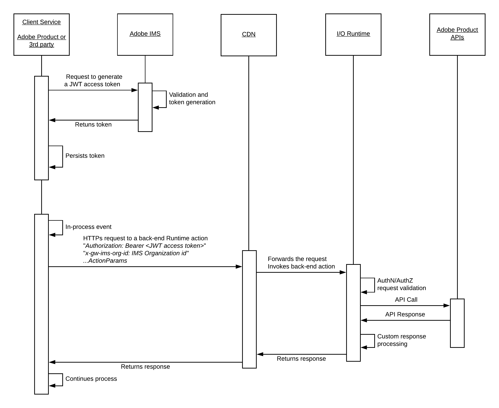
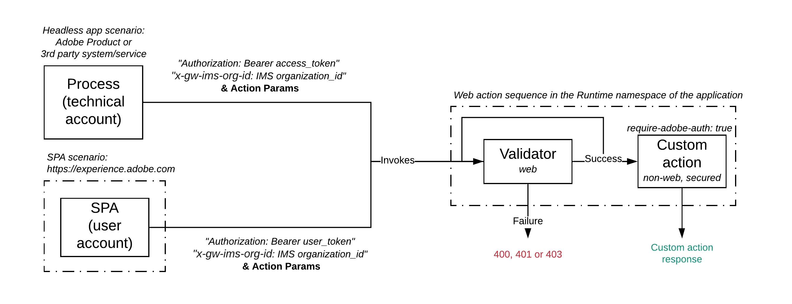

---
keywords:
  - Adobe I/O
  - Extensibility
  - API Documentation
  - Developer Tooling
---

# Security Overview

## Context

Every application development project has its own security requirements. Even for seasoned developers, these critical requirements can lead to complex and time-consuming implementations with an inappropriate support at SDK and tools level.

Project Firefly [SDK](https://github.com/adobe/aio-sdk) and [CLI](https://github.com/adobe/aio-cli) are designed to expedite the implementation of the typical security requirements for cloud-native applications that deploy into Adobe's ecosystem.

The following sections will focus on specific aspects of the security for Project Firefly Applications.

## Securing the Access to Project Firefly Applications

Any interaction with [Adobe Product APIs](/apis) needs to be authenticated against Adobe Identity Management Services (IMS).
The [Understanding Authentication](understanding_authentication.md) guide is a good pre-read to get deeper preliminary insights on those services.

### Adobe IMS Support for Project Firefly Applications

Project Firefly [SDK](https://github.com/adobe/aio-sdk) and [CLI](https://github.com/adobe/aio-cli) help developers to [bootstrap applications](../../getting_started/index.md) easily from application templates with `aio app init`. 
These include templates for Runtime web actions, which integrate with the [Adobe Product APIs](/apis) that can be extended with Project Firefly.
Any generated action is initialized with boilerplate code based on Project Firefly [SDK libraries](https://github.com/adobe/aio-sdk). Out-of-the box, the following steps are implemented:

- Validation that an Adobe IMS bearer token has been passed as Authorization header of the request which invoked this action
- Extraction of this bearer token for further usage in the action
- Instantiation of an API client, by using the appropriate product [SDK library](https://github.com/adobe/aio-sdk)
- Pre-configured API call, passing the required credentials, by using the same product [SDK library](https://github.com/adobe/aio-sdk)

### Securing Access to Headless Project Firefly Applications

Headless applications (e.g. Runtime actions or sequences) are usually executed as a back-end service invoked by another service - another Adobe product or a 3rd party system. For example:

- A custom asset worker integrating with AEM Assets as a Cloud Service
- An Adobe Campaign Standard Marketing Activity
- A 3rd party CRM workflow



A headless Project Firefly application requires to pass an Adobe IMS JWT access token in order to successfully call Adobe Product APIs. This token can be obtained within the [Developer Console](/console), by accessing the corresponding Project Firefly project and workspace.

However, its lifetime will be of 24 hours and it will expire afterwards. Consequently, developers have to manually refresh the token and update the application configuration every day. To automate this process, the [IMS SDK Library](https://github.com/adobe/aio-lib-ims) can be used to generate or renew the JWT access token directly from a custom Runtime action (which should not be a web-action so that no unauthorized user can access it).

This SDK library also uses the [State SDK Library](https://github.com/adobe/aio-lib-state) behind the scenes in order to persist the token in Project Firefly's cloud storage on behalf of the developer between two invocations of the Runtime action.

### Securing Access to Project Firefly SPAs

These SPAs are business-to-employees custom applications that deploy into the [Experience Cloud Shell](https://experience.adobe.com) for end-users of an Enterprise organization.


The SPA front-end interacts with Runtime web actions on specific events triggered at UI level.
In this scenario, the Experience Cloud Shell exposes a [client-side API](../exc_app/index.md), which can be used by the SPA to obtain the OAUth token generated for the logged-in Enterprise user. 
This token will be used by back-end Runtime actions to call [Adobe Product APIs](/apis), which need to be integrated in this application.

SPAs bootstrapped from the [CLI](https://github.com/adobe/aio-cli) with `aio app init` automatically include a [React-Spectrum](https://react-spectrum.adobe.com/) based front-end that integrates with the Experience Cloud Shell [client-side API](../exc_app/index.md) and sends the user OAuth token from the client to the invoked Runtime actions.

### Authentication and Authorization Handling
 
Every Project Firefly Application gets integrated to an out-of-the-box Authentication and Authorization handling layer when deployed from the [CLI](https://github.com/adobe/aio-cli) with `aio app deploy`.

Whether the application is headless or an SPA, this extra-security layer will check that:

- There is a bearer token passed as Authorization header of the calling request
- This token is validated successfully against Adobe IMS for authentication
- This token is validated successfully against [Adobe Exchange](https://exchange.adobe.com/) for authorization

[Adobe Exchange](https://exchange.adobe.com/) is the distribution platform for Project Firefly Applications. It will authorize a token if and only if:

- The invoked back-end action belongs to the Enterprise organization for which the token has been emitted
- The token is authorized to use the Adobe Product APIs, which are integrated in this Project Firefly Application



The authentication and authorization validation is enabled by default for every Runtime action bootstrapped from the [CLI](https://github.com/adobe/aio-cli) with `aio app init` or `aio app add action`. This results in a specific `require-adobe-auth` action annotation set to true in the application `manifest.yml` file:

```
packages:
  helloworld:
    actions:
      hello:
        function: hello.js
        web: 'yes'
        annotations:
          require-adobe-auth: true
```

Upon deployment with `aio app deploy`, the manifest will be dynamically rewritten and replace the custom Runtime actions by Runtime sequences. The action definition above will by seamlessly rewritten into:

```
packages:
  helloworld:
    actions:
      __secured_hello:
        # non-web
        function: hello.js
    sequences:
      hello: 
        actions: '/adobeio/shared-validators/<validator>,helloworld/__secured_hello'
        web: 'yes'
```

The first action of the sequence is an out-of-the-box shared action. All data required to authenticate and authorize the calling client is extracted from the incoming request.
This data is passed to an out-of-the-box service, which performs the necessary validation against Adobe IMS and Adobe Exchange. The custom action invocation will be chained if and only if the validation is successful, as highlighted on the sequence diagram below:


A developer can still choose to unprotect a specific action by setting the `require-adobe-auth` annotation to `false` or by deleting it and redeploying the application with `aio app deploy` afterwards.
However, we strongly recommend to validate these changes against the application security requirements, and to keep the `require-adobe-auth` annotation value to `true` for any action integrating with one or several [Adobe Product APIs](/apis).

**Note:** Project Firefly doesn't offer 3rd party API management at this stage, and similar authentication/authorization handling against 3rd party services should be managed by developers within their custom action codes for the time being.

#### Known Issue: Final and Web Annotations

The `require-adobe-auth` annotation is not compatible with the `final` annotation, which is protecting default parameters in web actions. More precisely, the `final` annotation won't have any effect when the `require-adobe-auth` annotation is set.
This also impacts other web action annotations such as `web-custom-options`.
See https://github.com/adobe/aio-cli-plugin-runtime/issues/150 for more details.

A workaround for supporting final parameters without relying on the `final` annotation is to set them using the [State](https://github.com/adobe/aio-lib-state) SDK. Parameters set in State will be shared among actions running within the same namespace. You can set a permanent value in State from outside an Adobe I/O Runtime action by calling this endpoint: 
```bash
curl -X POST -u <owAuth> https://adobeio.adobeioruntime.net/api/v1/web/state/put \
-H 'Content-Type: application/json' \
--data '{"namespace":"<owNamespace>","key":"<stateKey>","value":"<stateValue>","ttl":"-1"}'
```

However, note that we **strongly discourage** using the [State](https://github.com/adobe/aio-lib-state) SDK in order to store secrets that could be reused within Adobe I/O Runtime actions. For this, developers should use an appropriate Secret Vault to fulfil their custom application requirements.

#### Known Issue 2: Additional scope for JWT access token validation

The validator action enabled by `require-adobe-auth: true` annotation requires the provided IMS access token to have the `read_organizations` scope. While it is always the case for user tokens used in SPAs, the JWT access tokens used in headless applicationss may not have this scope. This will be the case if it is generated to integrate with the following services:
- Adobe Analytics
- Adobe Campaign Standard
- No API Service enabled

In these cases, the "I/O Management API" service must be added to the appropriate Project Firefly workspace. This will add the required scope to the JWT access token used by the headless application.

## Securing Project Firefly Applications

### I/O Runtime Specific guidelines

The [security guidelines for I/O Runtime](/apis/experienceplatform/runtime/docs#!adobedocs/adobeio-runtime/master/guides/security_general.md) generally apply for the back-end actions of a Project Firefly application.

The guidelines below are specific to Project Firefly applications.

### Transport Security

Developers building Project Firefly Applications on top of the out-of-the-box infrastructure will benefit from HTTPS connections between all the components that are part of this infrastructure.

We strongly recommend to ensure that every 3rd party system or service integrating with a Project Firefly Application supports HTTPS connections as well.
 
### Tenant Isolation

Project Firefly Applications and Services provide tenant isolation by default. 
A Project Firefly Application gets deployed into a Project Firefly Workspace defined within the [Developer Console](/console) for a give Project Firefly project.
Each Project Firefly Workspace owns its own Runtime namespace.

This combination of `Enterprise Organization`, `Project`, `Workspace` and `Runtime Namespace` define a granular tenant isolation for each deployed Project Firefly Application.

#### Runtime Actions

The back-end Runtime actions used by a Project Firefly Application respect the [tenant isolation model](/apis/experienceplatform/runtime/docs#!adobedocs/adobeio-runtime/master/quickstart.md#security-considerations) implemented by I/O Runtime.

#### Cloud Storage and CDN for SPA Static Files

If a Project Firefly Application is an SPA that deploys into the [Experience Cloud Shell](https://experience.adobe.com), the static assets of the SPA get deployed from the  or from a [CI/CD pipeline](../deployment/ci_cd_for_firefly_apps.md) to Project Firefly's Cloud Storage and CDN.

Both of them have a strict isolation per Runtime namespace. It is only possible to access the Cloud Storage container hosting a Project Firefly SPA by configuring the [CLI](https://github.com/adobe/aio-cli) with the appropriate workspace credentials.

The CDN serves these static assets from a sub-domain exclusively dedicated to the Runtime namespace associated to the Project Firefly Application workspace to which the SPA is deployed.

#### Files & State Services

The [Files](https://github.com/adobe/aio-lib-files) and [State](https://github.com/adobe/aio-lib-state) SDK libraries from the Project Firefly SDK provide an abstraction to interact with Project Firefly Cloud Storage and Key-Value Store from a Runtime action. 
The access to the data stored in these underlying services is restricted to the Runtime namespace in which the action is executed.

#### Project Firefly Apps Service

The `Project Firefly Apps` application available to each Enterprise Organization within the Experience Cloud Shell is nothing more than a Project Firefly Application that is deployed following the access and isolation paradigms documented in this guide.

## Summary

Project Firefly [SDK](https://github.com/adobe/aio-sdk) and [CLI](https://github.com/adobe/aio-cli) provide out-of-the-box support for developers to implement secure Adobe-native applications that deploy into Project Firefly serverless infrastructure and integrate with Adobe Product APIs.

Developers are able to build serverless processes and user-context aware applications with minimal knowledge of Adobe's authentication and authorization mechanisms for the Enterprise while not having to worry about other key concepts such as tenant isolation.
