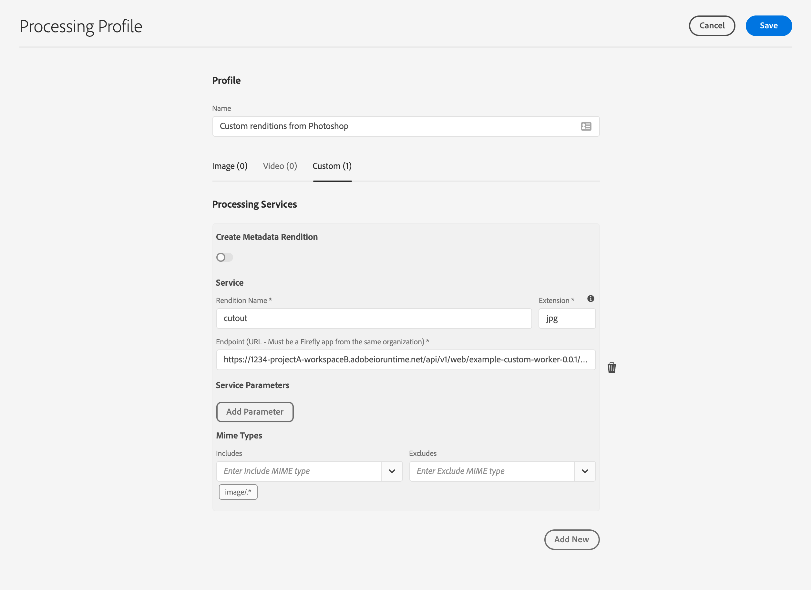

---
keywords:
  - Adobe I/O
  - Extensibility
  - API Documentation
  - Developer Tooling
contributors:
  - 'https://github.com/duynguyen'
title: 'Lesson 4: Integrate and use the custom worker in AEMaaCS'
---

# Lesson 4: Integrate and Use the Custom Worker in AEMaaCS

When the custom workers are done, you could deploy them onto I/O Runtime serverless platform to make them ready for integration in AEMaaCS. Execute the command `aio app deploy`, which will output all the endpoints of your custom workers in this format `https://1234-projectA-workspaceB.adobeioruntime.net/api/v1/web/dx-asset-compute-worker-1/worker-name`.

Next, in AEMaaCS, go to `Tools -> Assets -> Processing Profiles` to create a new processing profile. Give it a name, then under the Custom tab, configure the processing service to map the custom worker endpoints to corresponding renditions.

After saving the new profile, you need to apply it to a DAM folder.

Finally, you can test your custom workers by uploading images to the applied folder. After a few seconds for image processing, you can see the new renditions including the "cutout" generated by the custom worker.

Photo courtesy of [gudellaphoto](https://stock.adobe.com/contributor/144023/gudellaphoto) on [Adobe Stock](https://stock.adobe.com/images/vik-iceland-may-08-2015-toyota-rav4-four-wheel-drive-suv-being-used-on-iceland-s-unpaved-roads-and-terrain/283907742).
