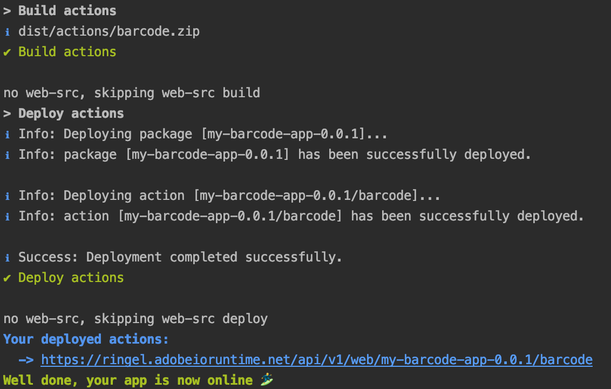

---
keywords:
  - Adobe I/O
  - Extensibility
  - API Documentation
  - Developer Tooling 
---

# Lesson 2: Writing a Serverless Action

There are many existing npm packages to display a barcode. Some don't play well in serverless environments. 
For this codelab, we'll use [bwip-js](https://www.npmjs.com/package/bwip-js/) to render a code128 barcode. 

## Barcode action

First, install the dependency with: 

```bash
npm i bwip-js --save
```

Then import the dependency in your action: 

```javascript
const bwipjs = require('bwip-js');
```  

Now we can use the library and generate a barcode buffer in the exported main function:  

```javascript
const buffer = await bwipjs.toBuffer({
  bcid: 'code128',
  text: params.value,
  scale: 3,
  height: 10,
  includetext: false,
});
``` 

Notice that we defined a `value` parameter to be passed to the barcode generator configuration. 
This is the actual data that the barcode will be holding. 

Then we can return the image representation of the buffer with: 

```javascript
return {
  headers: { 'Content-Type': 'image/png' },
  statusCode: 200,
  body: buffer.toString('base64')
};
```

Finally we can add checks to verify the requested `value` parameter, add logging and appropriate error handling to obtain following action: 

```javascript
const { Core } = require('@adobe/aio-sdk');
const { errorResponse, stringParameters, checkMissingRequestInputs } = require('../utils');
const bwipjs = require('bwip-js');

// main function that will be executed by Adobe I/O Runtime
async function main (params) {
  // create a Logger
  const logger = Core.Logger('main', { level: params.LOG_LEVEL || 'info' });

  try {
    // 'info' is the default level if not set
    logger.info('Calling the main action');

    // log parameters, only if params.LOG_LEVEL === 'debug'
    logger.debug(stringParameters(params));

    // check for missing request input parameters and headers
    const requiredParams = ['value'];
    const errorMessage = checkMissingRequestInputs(params, requiredParams);
    if (errorMessage) {
      // return and log client errors
      return errorResponse(400, errorMessage, logger);
    }
  
    const buffer = await bwipjs.toBuffer({
      bcid: 'code128',
      text: params.value,
      scale: 3,
      height: 10,
      includetext: false,
      backgroundcolor: 'ffffff'
    });
    
    return {
      headers: { 'Content-Type': 'image/png' },
      statusCode: 200,
      body: buffer.toString('base64')
    };
  } catch (error) {
    // log any server errors
    logger.error(error);
    // return with 500
    return errorResponse(500, error.message, logger);
  }
}

exports.main = main;

``` 

You can run the action locally using the CLI with: 

```bash
aio app run --local
```
 
which will: 

1. Start a local [OpenWhisk](https://openwhisk.apache.org/) stack on Docker. 
2. Package and deploy the Runtime action and its dependencies using a built-in webpack configuration.   
3. Start a local development environment and provide the action url e.g. `http://localhost:3233/api/v1/web/guest/my-barcode-app-0.0.1/barcode` for testing and debugging. 

Note that we'll cover how to do debug a Firefly app in another codelab.

Now if you add the value parameter to the url e.g. `?value=test`, the action should generate a barcode:


## Deploying

You can deploy a Firefly Headless app with `aio app run` or `aio app deploy`. This will deploy the actions to Adobe I/O Runtime.
`aio app deploy` would have deployed the UI to a CDN but since we don't have any UI, that step is simply ignored. We'll have a separate codelab to guide you through building a Firefly App with UI.

Make sure to set your Adobe I/O Runtime secrets (namespace and auth) in the `.env` file. 
We'll also turn off the built-in authentication by setting `require-adobe-auth: false` in the `manifest.yml`.    
The security topic will be covered in a dedicated codelab.

Hitting deploy with the CLI will output the deployed action url:

  

**Congratulations ! Your first Firefly Headless App is live.** 

How can we test that the passed value is actually rendered as a barcode ? Luckily for us, there are also barcode readers that we can leverage in our tests.


