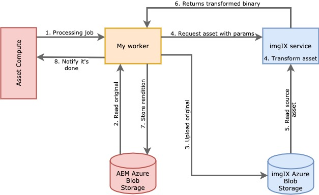

---
keywords:
  - Adobe I/O
  - Extensibility
  - API Documentation
  - Developer Tooling
contributors:
  - 'https://github.com/marcinczeczko'
title: Architecture of our worker
---

# Architecture of our worker

We're going to build a custom worker for Asset Compute service that will produce renditions using the **[imgIX][imgix]** service.

**imgIX** is an immensely powerful image processing service that is composed of three layers:

- imgIX CDN to cache and deliver rendered images
- imgIX rendering cluster where all the magic happens
- The source which is the place where your source images are hosted, and from where a rendering cluster initially pulls
  the image. In our case, it will be Azure blob storage.

The service architecture suggests that it's mainly built to provide a layer delivering transformed and optimized assets
directly to your website (via the dedicated domain). However, for the sake of this article, we will use it differently -
our worker will fetch the rendered images from imgIX and transfer it to the AEM storage, instead of serving them
directly from imgIX CDN on the website.

A conceptual diagram of data flow for our solution looks like below.

- On each processing job, our worker first transfers the source image from AEM binaries cloud storage to the Azure blob
  storage being a source of assets at imgIX.
- Once it's done, the worker generates a URL to the imgIX. The URL holds the parameters on how to transform the image.
  These parameters come from the processing job and are provided by the AEM user while configuring what renditions to
  generate.
- The last thing it does is downloading the asset from the generated URL and uploading it back to the AEM binaries cloud
  storage.

[imgix]: https://www.imgix.com/
