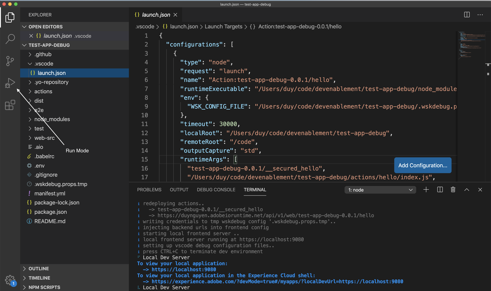

---
keywords:
  - Adobe I/O
  - Extensibility
  - API Documentation
  - Developer Tooling
contributors:
  - 'https://github.com/duynguyen'
title: 'Lesson 1: Getting familiar with Debugger'
---

# Lesson 1: Getting to know wskdebug

First, you need an app created with AIO CLI:

Open the app in VSCode, and execute `aio app run` in the terminal. Optionally, you can add `--local` flag to make your actions run in the local OpenWhisk environment, and the `--verbose` flag to see more inspection details of your deployment.

You will see the automatically generated VSCode launch profile in `.vscode/launch.json`, with a few available configurations:

* `Action:test-app-debug-0.0.1/hello` for debugging the `hello` action
* `Web` for debugging the UI components
* `Actions` (compound) for debugging all actions
* `WebAndActions` (compound) for debugging all actions and UI components (end to end)

Navigate to "Run" mode:

Select the `WebAndActions` profile, and click the Start Debugging button:

The web UI will appear immediately. But the action launch may take  up to 10 seconds. You could confirm that the action is ready in the Action view of Debug Console:

Invoke the `hello` action from the user form on UI. You will see a `Failure! See the error in your browser console.` error, which is expected.

