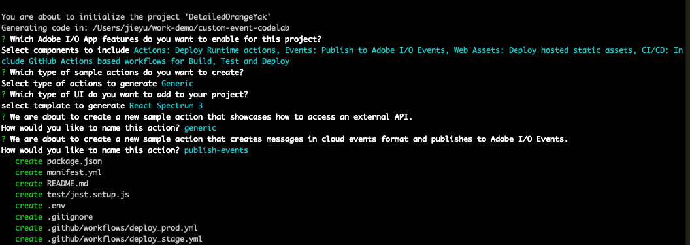

---
keywords:
  - Adobe I/O
  - Extensibility
  - API Documentation
  - Developer Tooling
contributors:
  - https://github.com/Yu1986
---

# Lesson 1: Create a New Firefly App from Template 

## Create a Console Integration and Set up Project
In order to use custom events CLI plugin, you need to get below information from console integration.

- `IMS Org Id`: The Organization Id in which the provider, event metadata, etc are to be created. 
- `API key`: The API Key (client id) for the integration (project workspace)
- `JWT Token`: Note that I/O Management Service needs to be enabled for the integration
- `Config.zip`: Config file downloaded from console including `private key` and `certificate_pub.crt`
- `project.json`: for instance, `projectname-orgId-Production.json` file downloaded from console 


1. Navigate to Adobe I/O console at [https://console.adobe.io](https://console.adobe.io) in your browser and create a project using App Builder template or using your exsiting project 

2. Select `Add to Project` -> `Add an API` -> `Adobe Services` -> `I/O managemenet API`


3. Follow the steps to configure API, create a new service account (JWT) credential, `config.zip` will be
downloaded automatically, you will need the private key to generate JWT token.

4. Go to `project overview` tab, download project metadata from `Download` button and get the needed info from this `.json`file, or you can also get these info from `.aio` file in the project folder.

## Initialize a Firefly app using CLI template

To initialize a App Builder app, let's use init command from the CLI. More information please refer to [Creating your First App Builder Application](https://www.adobe.io/project-firefly/docs/getting_started/first_app/)

```bash
aio app init <Your-project-name> --no-extensions
```

You will be presented with a few options, first question is "Which Adobe I/O App features do you want to enable for this project?" In this lab, we keep all of them. The second question is "Which type of sample actions do you want to create?" in this lab, we will select `Generic`, please remember to keep the `publish-event` template.
Name your action, then you have created your App Builder template. Now you can use this template to start your app



In this lab, user will create a webpage using this generic template. if this is your first time to use App Builder, follow below instructions:
* [Creating your First Firefly App](../../getting_started/first_app.md)

In next lesson, we will show how to use custom event to register this app as event provider and click the `invoke` button 
to fire an event, this event will be consumed by three ways (Journaling API, webhook URL, runtime action)

