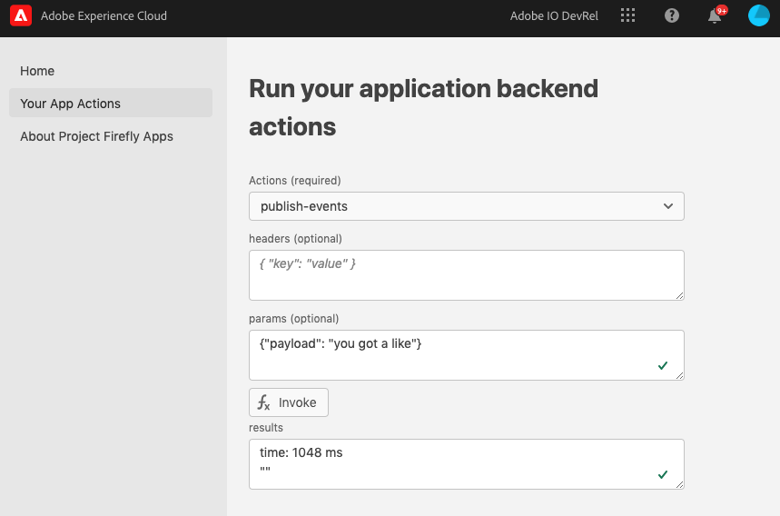
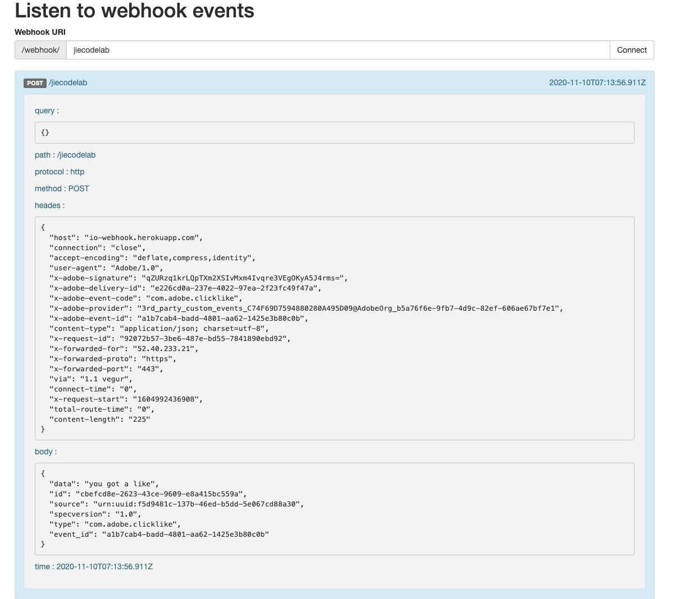

---
keywords:
  - Adobe I/O
  - Extensibility
  - API Documentation
  - Developer Tooling
contributors:
  - 'https://github.com/Yu1986'
title: 'Lesson 3: Fire an Event'
---

# Lesson 3: Fire an Event

## Fire Event
Once you set up the app and register the event provider, now you can make user click `invoke` button as fire event, this lesson will walk through the code in `publish-event` template, test it on the UI with "invoke" button and see the success response (in this lession using webhook)

You can choose to use this template code at `/actions/publish-events/index.js` or create your own code.
Within the newly created app, Firstly, set up `package.json` with the lists of dependencies, version, etc. 
Then `manifest.yml` lists the declaration of serverless actions including name, source files, runtime kind, default params, annotations, and so on. In this lesson, we will choose to use this template to modify the code to our need.

Note: here put in the `providerId`,`apiKey` and `eventCode`from lesson 2 in the `manifest.yml` and `orgId`,`accessToken`can be passed through `headers`

Below is a sample `app.config.yaml` 
```javascript
application:
  actions: actions
  web: web-src
  runtimeManifest:
    packages:
      my-app:
        license: Apache-2.0
        actions:
          generic:
            function: actions/generic/index.js
            web: 'yes'
            runtime: 'nodejs:18'
            inputs:
              LOG_LEVEL: debug
            annotations:
              require-adobe-auth: true
              final: true
      publish-events:
        function: actions/publish-events/index.js
        web: 'yes'
        runtime: 'nodejs:18'
        inputs:
          LOG_LEVEL: debug
          apiKey: <Your-SERVICE_API_KEY>
          providerId: <YOUR-PROVIDER_ID>
          eventCode: <YOUR-EVENT_CODE>
        annotations:
          final: true
```

Now let's start to take a deeper look the template code: 

* Source code is at `actions/publish-events/index.js`
* It is a [web action](/runtime/docs/guides/using/creating_actions/#invoking-web-actions)
* The action will be run in the `nodejs:18` [runtime container on I/O Runtime](/runtime/docs/guides/reference/runtimes)
* It has some [default params](/runtime/docs/guides/using/creating_actions/#working-with-parameters) such as `LOG_LEVEL`, you can pass in your `params` like `apiKey`, `provideId` and `eventCode`from `manifest.yml`

```javascript
const { Core, Events } = require('@adobe/aio-sdk')
const uuid = require('uuid')
const { CloudEvent } = require('cloudevents')
const { errorResponse, getBearerToken, stringParameters, checkMissingRequestInputs } = require('../utils')

// main function that will be executed by Adobe I/O Runtime
async function main (params) {
  // create a Logger
  const logger = Core.Logger('main', { level: params.LOG_LEVEL || 'info' })

  try {
    // 'info' is the default level if not set
    logger.info('Calling the main action')

    // log parameters, only if params.LOG_LEVEL === 'debug'
    logger.debug(stringParameters(params))

    // check for missing request input parameters and headers
    const requiredParams = ['apiKey', 'providerId', 'eventCode', 'payload']
    const requiredHeaders = ['Authorization', 'x-gw-ims-org-id']
    const errorMessage = checkMissingRequestInputs(params, requiredParams, requiredHeaders)
    if (errorMessage) {
      // return and log client errors
      return errorResponse(400, errorMessage, logger)
    }

    // extract the user Bearer token from the Authorization header
    const token = getBearerToken(params)

    
    // initialize the client
    const orgId = params.__ow_headers['x-gw-ims-org-id']
    const eventsClient = await Events.init(orgId, params.apiKey, token)

    // Create cloud event for the given payload
    const cloudEvent = createCloudEvent(params.providerId, params.eventCode, params.payload)

    // Publish to I/O Events
    const published = await eventsClient.publishEvent(cloudEvent)
    let statusCode = 200
    if (published === 'OK') {
      logger.info('Published successfully to I/O Events')
    } else if (published === undefined) {
      logger.info('Published to I/O Events but there were not interested registrations')
      statusCode = 204
    }
    const response = {
      statusCode: statusCode,
    }

    // log the response status code
    logger.info(`${response.statusCode}: successful request`)
    return response
  } catch (error) {
    // log any server errors
    logger.error(error)
    // return with 500
    return errorResponse(500, 'server error', logger)
  }
}

function createCloudEvent(providerId, eventCode, payload) {
  let cloudevent = new CloudEvent({
    specversion: "1.0",
    source: 'urn:uuid:' + providerId,
    type: eventCode,
    id: uuid.v4(),
    data: payload,
  })

  return cloudevent;
}
exports.main = main

```
What happens here is that the action exposes a `main` function, which accepts a list of params from the client. It checks the required params for using the `cloudevents-sdk`. 

You can run the App Builder app locally by execute the below command with AIO CLI:
```bash
aio app run
```
This command will deploy the `publish-event` action into I/O Runtime, and spins up a local instance for the UI. When the app is up and running, it can be seen at `https://localhost:9080`. You should be able to see the UI of the app and it is also possible to access the app from ExC Shell: `https://experience.adobe.com/?devMode=true#/apps/?localDevUrl=https://localhost:9080`. You might be asked to log in using your Adobe ID.  When the website is opened, the UI is almost similar to what you see when deployed on localhost, except the ExC Shell on top of the UI.

Once you are satisfied with your app, you can deploy your app by run below command:
```bash
aio app deploy
```
This command will deploy the app to your namespace, you will get the URL like 
`https://<Runtime-namespace>.adobeio-static.net/<project-name>-0.0.1/index.html`
and you will see your deployed link in the terminal

Next, let's see how the web UI communicates with the backend. In `web-src/src/components` we already provide a template of UI.
After you select the actions to `publish-events` and then click the `invoke` button, it will invoke the action. In the action, it will send out the event. When you invoke, you could also add actual params, in this example, we add `{"payload": "you got a like"}`, in the webhook result, you will see the payload showed in `{"data": "you got a like"}`.

Note: Here I use the webhook tool [here](https://io-webhook.herokuapp.com/) to generate a webhook link and put this webhook to the console integration. You can use other webhook tool as discussed in lession 4. 






