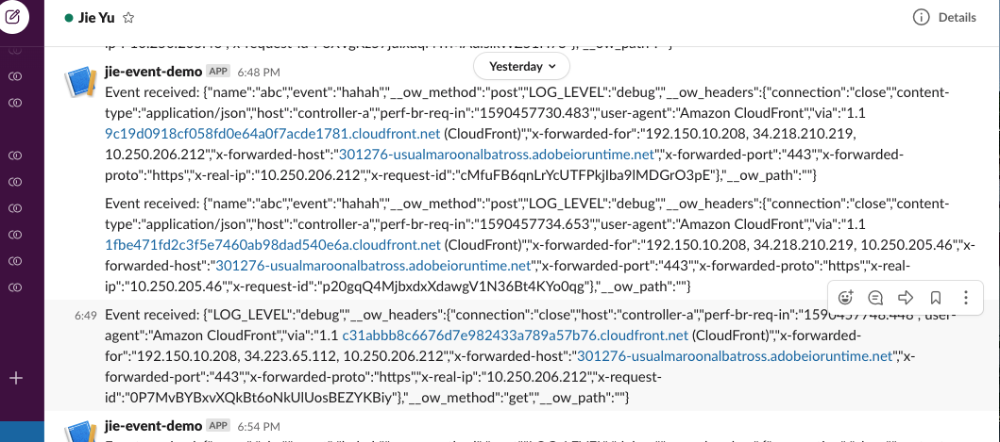

---
keywords:
  - Adobe I/O
  - Extensibility
  - API Documentation
  - Developer Tooling
contributors:
  - 'https://github.com/Yu1986'
title: 'Lesson 4: Consume Events'
---

# Lesson 4: Consume Events

There are three ways one can consume event:
* Using Journaling API 
* Using runtime action 
* Using webhook URL


## Option 1: Using Journaling API to consume events 
For enterprise developers, Adobe offers journaling to consume events. The Adobe I/O Events Journaling API enables enterprise integrations to consume events according to their own cadence and process them in bulk. Unlike webhooks, no additional registration or other configuration is required; every enterprise integration that is registered for events is automatically enabled for journaling. Journaling data is retained for 7 days. 

After you fire event, you should be able to verify your event through journaling `UNIQUE API ENDPOINT` you get from console by follow below instruction
[Journaling api](/events/docs/guides/api/journaling-api/)
you could use `Curl` command or `POSTMAN` to call this journaling `UNIQUE API ENDPOINT` to see your fired event.
Or you can use [Custom event SDK](https://github.com/adobe/aio-lib-events/) to call Journaling API to retrieve your event.


## Option 2: Using runtime action
Once you have access to [Adobe I/O Runtime](/runtime) (in our case you already have) and you have your [slack webhook url defined](https://api.slack.com/incoming-webhooks) :
* Edit the `app.config.yaml` to add an action called slack 
```javascript
 slack:
        function: actions/slack/index.js
        web: 'yes'
        runtime: 'nodejs:14'
        inputs:
          LOG_LEVEL: debug
        annotations:
          final: true
```
Add in the actions folder with `actions/slack/index.js` with below sample code

```javascript
 var request = require('request');

/* default slackwebhook and channel add yours here and replace the TODO below */
/* this is a sample action for how to receive event and sent a message to slack */
var request = require('request');

/* default slackwebhook and channel add yours here and replace the TODO below */
var slackWebhook = "<your-webhook>";
var slackChannel = "<your-slack>";

async function main (params) {
  
  /* print event detail */
  console.log('in main + event detail: ', params.event);

  var returnObject = {
    statusCode: 200,
    headers: {
      'Content-Type': 'application/json'
    },
    body: ""
  };

  /* handle the challenge */
  if (params.challenge) {

    console.log('Returning challenge: ' + params.challenge);

    returnObject.body = new Buffer(JSON.stringify({
      "challenge": params.challenge
    })).toString('base64');

    return returnObject;

  } else {

    /* we need it to run asynchronously, so we are returning a Promise */
    return new Promise(function (resolve, reject) {

      var slackMessage = " Event received: " + JSON.stringify(params);

      var payload = {
        "channel": slackChannel,
        "username": "incoming-webhook",
        "text": slackMessage,
        "mrkdwn": true,
      };

      var options = {
        method: 'POST',
        url: slackWebhook,
        headers:
            { 'Content-type': 'application/json' },
        body: JSON.stringify(payload)
      };

      request(options, function (error, response, body) {
        if (error) {

          console.log("ERROR: fail to post " + response);

          reject(error);

        } else {

          console.log ("SUCCESS: posted to slack " + slackMessage);

          returnObject.body = new Buffer(JSON.stringify({
            "slackMessage": slackMessage
          })).toString('base64');

          resolve(returnObject);
        }

      });

    });

  }
}

exports.main = main
```
After you deployed your runtime action, you can verfiy the webhook is working by 
```bash
curl -X POST -H 'Content-type: application/json' --data '{"text":"Hello, World!"}' https://<your-namespace>.adobeio-static.net/api/v1/web/event-demo-0.0.1/slack
```
In addtion, in developer console, you will be able to see 
Select the slack one and save it. Now when you fire event, you should be able to receive a slack message every time people click the like button 


## Option 3: Using webhook to consume events 
You could configure another event delivery method through console by `Edit Events Registration` and add webhook 


Before you can register a webhook, the webhook needs to be online and operational. If not, then the registration will fail. So you need to take care of setting that up first. Your webhook must be hosted on a server. For development, you may use localhost along with a tool like [Ngrok](https://ngrok.com/).

Your webhook needs to
-   be accessible from the internet (localhost won't work)
-   be reachable over HTTPS
-   correctly respond to a "challenge" request
For more details, follow the link below: 
[how to use webhook](/events/docs/guides/)

## Let's test it, and fire events
With that,once you fire the event (in our codelab case, click the invoke button) you should see them appearing in above three options:
- Through Adobe I/O Journaling API 
- Get slack message - through slack runtime action webhook
- Through webhook URL


