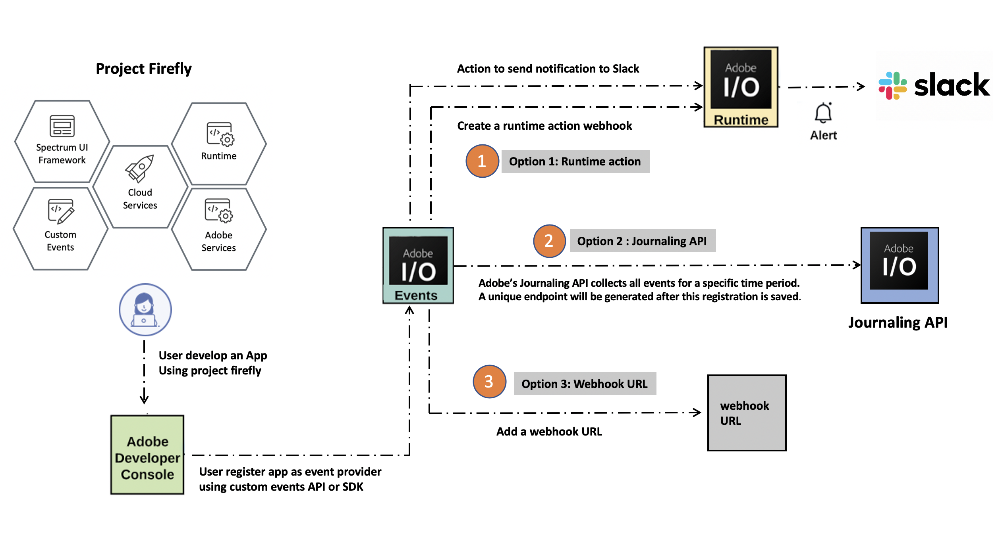

---
keywords:
  - Adobe I/O
  - Extensibility
  - API Documentation
  - Developer Tooling
contributors:
  - https://github.com/Yu1986
---

# Requirements

## Pre-requisites
This codelab is for anyone who are getting started with developing Firefly apps. There are a few prerequisites to get you started

* Project Firefly app

This lab will be focus on Adobe I/O Events CLI plugin, for how to bootstrap Firefly app please see below or other codelab contents
we assume that you already have an app developed and would like to leverage I/O event to build an event-driven flow
  * [How to Get Access to Project Firefly](https://github.com/AdobeDocs/project-firefly/blob/master/overview/getting_access.md)
  * [Setting up Your Environment](https://github.com/AdobeDocs/project-firefly/blob/master/getting_started/setup.md)
  * [Creating your First Firefly App](https://github.com/AdobeDocs/project-firefly/blob/master/getting_started/first_app.md)
  * [Adobe I/O Events CLI Plugin](https://github.com/adobe/aio-cli-plugin-events)

To install the Adobe I/O Events CLI Plugin, simply run below: 
```bash
npm install -g @adobe/aio-cli-plugin-events
```  
## Console Integration

We assume you have access to create integration on [Adobe I/O Console](https://console.adobe.io/) with `I/O Management Service` needs to be enabled for the integration. This will help create the JWT token with adobeio_api scope which is required for all the API calls.

## Custom Event Architecture Overview


