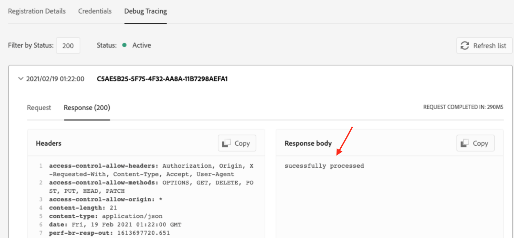
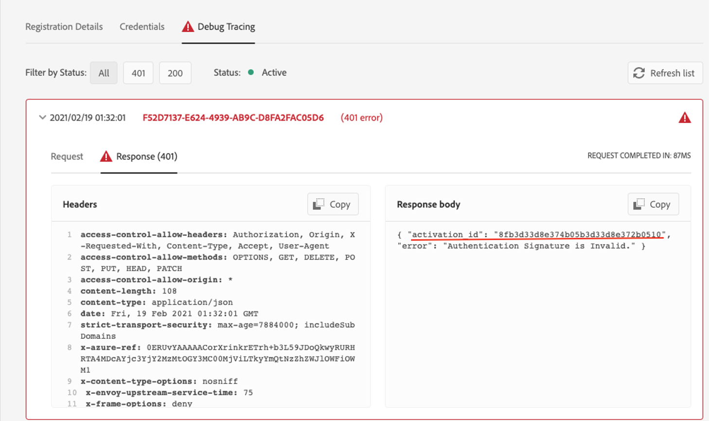

---
keywords:
  - Adobe I/O
  - Extensibility
  - API Documentation
  - Developer Tooling
contributors:
  - 'https://github.com/Yu1986'
title: 'Lesson 2: Verify the result'
---

# Lesson 2: Verify the result

## Deep dive in
Now let's take a deeper look into these actions:
- `bound_package` : default param package created as binding of the shared package deployed in adobe namespace and having the validate action inside itself. Now, this bound_package will also have the validate_action residing in it due to binding.
- `acp` - package created which will keep the new sync_event_handler sequence
- `sync_Event_handler_7Z5KH5vv6X` - the new event handler unique to this registration with webhook url
- `3rd_party_custom_events_3C9419175E9D393C0A495E39@AdobeOrg_2a0237a4-f0d3-45e9-8179-10ab21ef929c_eventrt_7Z5KH5vv6X` - the user sequence created taking the validate action as first action and user runtime action as second action. Created with the same unique identifier suffixed at the end of its name to bind this user sequence with the event registration in 1:1 fashion.

## Tracing Actions with Activation Ids
Debug Tracing is a pretty important tool on Developer Console for users who want to be informed whether their runtime action invocation is successful or not or what it responds.
After setting up a runtime action as webhook, upon its successful invocation, you can see custom response returned from your own runtime action in the Debug Tracing webhook response section as below.

 However, in case of any failed invocation to your webhook, you will get an error response body with an activation id for the same. This helps users to debug their actions as below

This activation id you can use in the aio cli to trace the actual error occurred in your invocation by doing aio rt activation logs

You may now get activation ids for two types of failed activations -

- Signature Validator Action
- Your Runtime Action
- In case of failure in the signature verification step, this is how you will get the error response and the failed activation id for the same.

For failed invocation to your runtime action, you will get an error response with the failed activation id for the same like below

